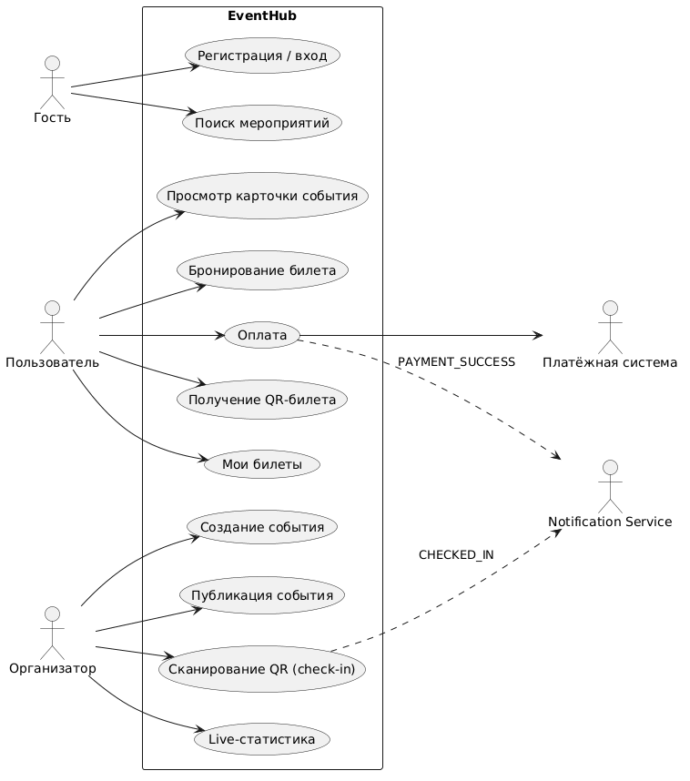

# EventHub — платформа для организации мероприятий

## О проекте

EventHub — сервис, где организаторы создают мероприятия и продают билеты,
а пользователи находят события, бронируют и оплачивают билеты, получают
QR-билеты и уведомления.

## Команда
Группа: ПМат-241

| Роль           | ФИО                               |
|----------------|-----------------------------------|
| Разработчик №1 | Рунец Герман Дмитриевич           |
| Разработчик №2 | Слесарчик Екатерина Александровна |
| Разработчик №3 | Трошина Яна Ивановна              |
| Разработчик №4 | Домбровский Дарий Иванович        |

## Функциональные требования

### Пользователь (User)
- FR-01. Регистрация и вход (JWT).
- FR-02. Поиск и фильтрация мероприятий.
- FR-03. Просмотр карточки мероприятия.
- FR-04. Выбор типа билета и бронирование.
- FR-05. Оплата бронирования.
- FR-06. Получение QR-билета.
- FR-07. Просмотр списка «Мои билеты».
- FR-08. Email-уведомления.

### Организатор (Organizer)
- FR-09. Создание мероприятия.
- FR-10. Редактирование и удаление.
- FR-11. Публикация и отмена.
- FR-12. Место, категория, дата, места, изображение.
- FR-13. Типы билетов (Standard / VIP / Student).
- FR-14. Дашборд статистики.
- FR-15. Сканирование QR (check-in).
- FR-16. Live-статистика (WebSocket).

### Системные
- FR-17. Обмен событиями через RabbitMQ.
- FR-18. Валидация QR.
- FR-19. Роли: USER / ORGANIZER / ADMIN.

## Use Case

**Акторы:** Гость, Пользователь, Организатор, Платёжная система, Notification Service.

| Актор        | Use Case                                                |
|--------------|---------------------------------------------------------|
| Гость        | Регистрация / вход, Поиск мероприятий                   |
| Пользователь | Просмотр карточки, Бронирование, Оплата, QR, Мои билеты |
| Организатор  | Создание, Публикация, Сканирование QR, Live-статистика  |

## Технологический стек

| Слой           | Технологии                                               |
|----------------|----------------------------------------------------------|
| Frontend       | React + TypeScript, Axios, TailwindCSS                   |
| Backend        | Java 21, Spring Boot 3, Spring Security (JWT), JPA, AMQP |
| БД             | PostgreSQL                                               |
| Брокер         | RabbitMQ                                                 |
| Realtime       | WebSocket (STOMP)                                        |
| QR             | ZXing                                                    |
| Инфраструктура | Docker, Docker Compose, Nginx                            |

## 📊 Функции конкурентов и приоритеты

На основе анализа Eventbrite, Meetup, TimePad.

| Функция                                     | У кого              | Приоритет |
|---------------------------------------------|---------------------|:---------:|
| Регистрация / вход (JWT)                    | все                 | 🔴        |
| Каталог мероприятий с поиском и фильтрами   | все                 | 🔴        |
| Карточка мероприятия                        | все                 | 🔴        |
| Бронирование билета                         | все                 | 🔴        |
| Оплата (имитация)                           | Eventbrite, TimePad | 🔴        |
| QR-билет                                    | Eventbrite, TimePad | 🔴        |
| Check-in сканером                           | Eventbrite, TimePad | 🔴        |
| Email-уведомления                           | все                 | 🟡        |
| Live-статистика (WebSocket)                 | Eventbrite          | 🟡        |
| Типы билетов (Standard / VIP / Student)     | Eventbrite, TimePad | 🟡        |
| Кабинет организатора                        | все                 | 🟡        |
| Управление Venue / Category                 | Eventbrite, TimePad | 🟡        |
| Промокоды                                   | Eventbrite, TimePad | 🟢        |
| Waitlist (лист ожидания)                    | Eventbrite          | 🟢        |
| Рекомендации мероприятий                    | Meetup              | 🟢        |
| Сообщества / группы по интересам            | Meetup              | ⚪        |
| Интеграция со Stripe                        | Eventbrite, TimePad | ⚪        |

**Легенда (MoSCoW):**
- 🔴 **Must** — обязательно в MVP
- 🟡 **Should** — важно, но можно отложить
- 🟢 **Could** — желательно
- ⚪ **Won't** — не в этой итерации
